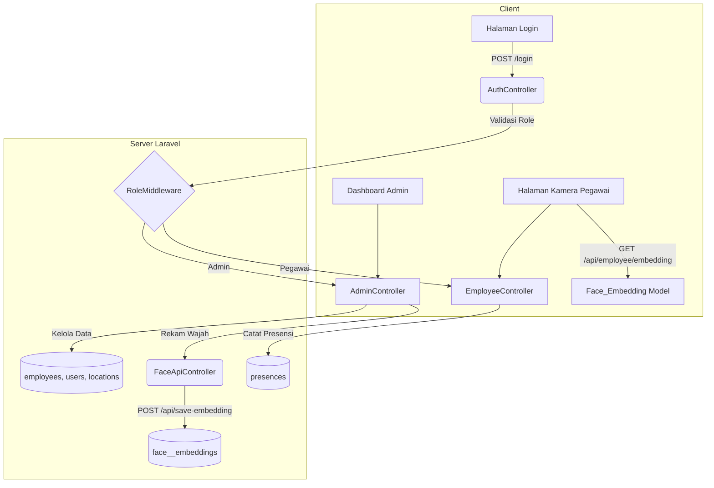
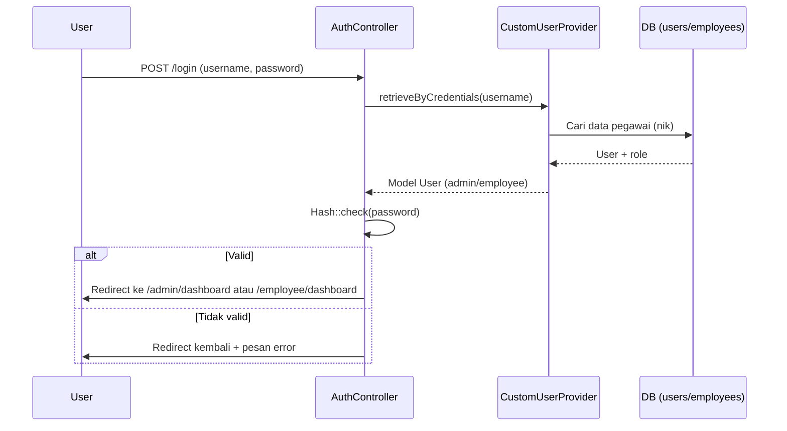
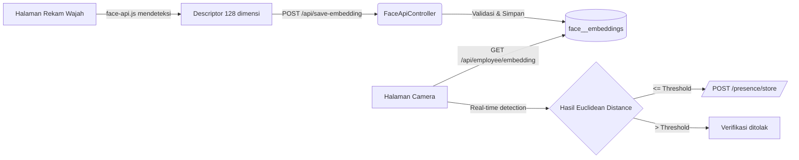

<p align="center">
  
</p>

# Face Verification Presence

Sebuah aplikasi web yang dibangun dengan Laravel untuk manajemen kehadiran atau presensi menggunakan teknologi verifikasi wajah.

## Tentang Proyek

Aplikasi ini memungkinkan pengguna untuk melakukan absensi dengan memindai wajah mereka. Sistem akan memverifikasi dan mencatat kehadiran secara otomatis. Proyek ini bertujuan untuk menyediakan solusi presensi yang modern, cepat, dan aman.

## Fitur Utama

*   **Registrasi Pengguna:** Pendaftaran akun untuk pengguna baru.
*   **Pengambilan Data Wajah:** Proses untuk merekam dan menyimpan data wajah pengguna.
*   **Verifikasi Wajah:** Pencocokan wajah secara real-time untuk absensi.
*   **Pencatatan Kehadiran:** Log atau riwayat kehadiran yang tercatat otomatis.
*   **Dasbor Pengguna:** Tampilan riwayat dan status kehadiran masing-masing pengguna.

## Arsitektur & Komponen

| Lapisan | Lokasi | Rangkuman |
| --- | --- | --- |
| **Routing** | `routes/web.php`, `routes/api.php` | Routing web memakai middleware `auth` dan `role:{admin/employee}`, sedangkan API publik saat ini hanya memuat endpoint `POST /api/save-embedding`. |
| **Controller Admin** | `app/Http/Controllers/AdminController.php`, `LocationController.php`, `FaceApiController.php` | Mengelola CRUD pegawai, lokasi kantor (dengan pengambilan koordinat otomatis via browser), serta perekaman embedding wajah. |
| **Controller Pegawai** | `app/Http/Controllers/EmployeeController.php`, `AuthController.php` | Mengatur login berbasis username/NIK, halaman dashboard/camera pegawai, dan pencatatan presensi (termasuk validasi bahwa hanya ada satu presensi masuk per hari). |
| **Model** | `app/Models/*.php` | Relasi utama: `User` ↔ `Employee` (1-1), `Employee` ↔ `Face_Embedding` (1-1), `Employee` ↔ `Presence` / `Permits` (1-n). File model masih menggunakan pewarnaan default Laravel dengan cast JSON untuk descriptor wajah. |
| **Middleware & Provider** | `app/Http/Middleware/RoleMiddleware.php`, `app/Auth/CustomUserProvider.php`, `app/Providers/AppServiceProvider.php` | Middleware memastikan role sesuai sebelum memasuki route, sedangkan custom user provider memungkinkan login pegawai memakai field NIK. |
| **Front-end** | `resources/views`, `resources/css`, `resources/js` | Layout admin/pegawai terpisah. Kamera memanfaatkan `face-api.js`, SweetAlert, dan model AI yang disajikan dari `public/models`. |

### Catatan Implementasi Penting

* Endpoint `/api/save-embedding` saat ini belum dilindungi middleware auth, sehingga perlu dipastikan akses dibatasi sebelum produksi.
* Penamaan kolom presensi perlu diselaraskan: model & migrasi menggunakan `waktu_masuk`/`waktu_pulang`, sementara controller & view memakai `jam_masuk`. Pastikan update ketika mulai menyimpan bukti kehadiran nyata.
* Seeder utama (`DatabaseSeeder`) sebaiknya memanggil `UserSeeder::class` agar akun admin/pegawai awal otomatis terbuat.

## Teknologi yang Digunakan

<p>
  
  
  
</p>

*   **Backend:** PHP 8.2+, Laravel 12
*   **Frontend:** Bootstrap
*   **Database:** (Dapat disesuaikan) MySQL, PostgreSQL, SQLite

## Panduan Instalasi

Berikut adalah langkah-langkah untuk menjalankan proyek ini di lingkungan lokal Anda.

**1. Clone Repository**
```bash
git clone [URL_REPOSITORY_ANDA]
cd Face-Verification-Presence
```

**2. Instal Dependensi**
Pastikan Anda memiliki Composer terinstal.
```bash
composer install
```

**3. Konfigurasi Lingkungan**
Salin file `.env.example` menjadi `.env` dan sesuaikan koneksi database Anda.
```bash
cp .env.example .env
```
Setelah itu, generate kunci aplikasi Laravel.
```bash
php artisan key:generate
```

**4. Migrasi Database**
Jalankan migrasi untuk membuat tabel-tabel yang dibutuhkan.
```bash
php artisan migrate
```

**5. Buat Symlink Storage**
Perintah ini wajib dieksekusi sekali di setiap mesin/server baru agar file foto presensi dapat diakses melalui URL.
```bash
php artisan storage:link
```

**5. Jalankan Aplikasi**
Jalankan server development Laravel.
```bash
php artisan serve
```
Aplikasi sekarang akan berjalan di `http://127.0.0.1:8000`.

## Bagan Alur & Diagram

### 1. Arsitektur Umum



### 2. Alur Login (Username/NIK)



### 3. Perekaman & Verifikasi Wajah



## Lisensi

Proyek ini dilisensikan di bawah [MIT License](https://opensource.org/licenses/MIT).
